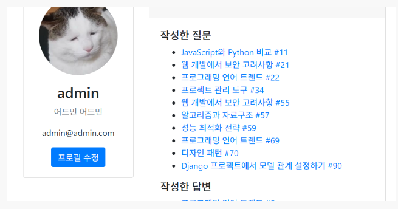
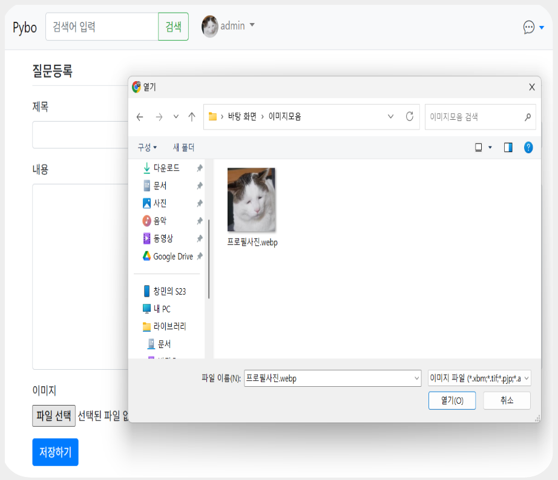
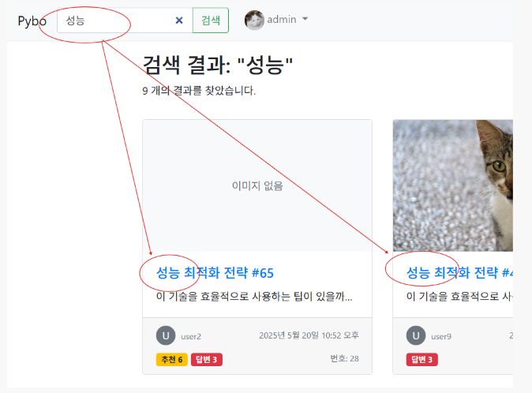
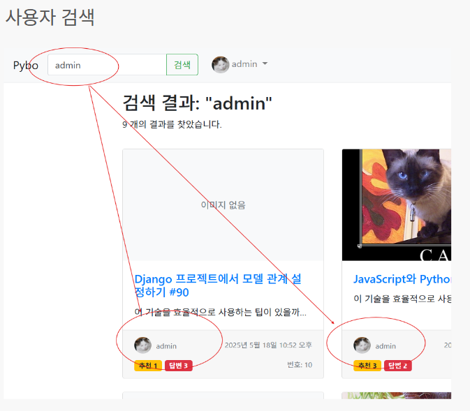
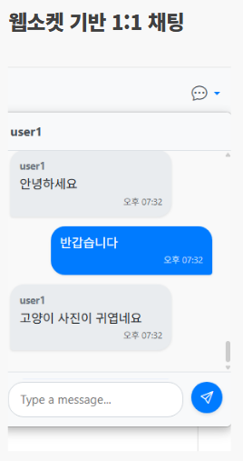

# Dango : 질문답변 플랫폼 (Q&A Platform)

이 프로젝트는 기존 Pybo를 기반으로 한 웹 애플리케이션으로, 사용자들이 프로필 관리, 이미지가 첨부된 게시글 작성, 키워드 검색, 실시간 1:1 채팅을 사용할 수 있는 커뮤니티 플랫폼입니다. 서버 사이드 랜더링 방식으로 제공됩니다.

## 주요 기능

### 사용자 프로필
- 회원가입 및 로그인
- 프로필 페이지 제공 및 프로필 사진 업로드 기능
- 프로필 정보 수정 기능



### 게시글 관리
- 이미지 첨부 및 미리보기 기능
- 게시글 수정 및 삭제
- 카드 섹션 나누기 (UI 개선)
- 댓글 작성 및 추천 수 기능
- 페이징 기능



### 키워드 검색
- 게시글 및 사용자 검색 기능




### 실시간 1:1 웹소켓 채팅
- 사용자 간 실시간 채팅 기능
- Channels와 Daphne(ASGI 서버), Redis 사용



## 기술 스택 및 인프라

- **Backend**: Django 4.2.21, Daphne, 클래스 기반 뷰(CBV), 서비스 레이어 분리, 커스텀 예외 처리
- **보안**: CSRF 토큰 처리
- **Database**: SQLite (기본 설정)
- **실시간 통신**: Channels, Redis
- **Frontend**: Django Templates, JavaScript
- **스타일링**: CSS
- **이미지 처리**: Pillow
- **서버 관리**: Nginx, systemd 등록
- **배포**: AWS (환경변수 등록 및 .env 파일 사용), SSL(Certbot 이용), 도메인 관리(DuckDNS 이용)

## 설치 방법

1. 저장소 클론
```bash
git clone https://github.com/picetea44/WebServerAD.git
cd ADProject
```

2. 가상환경 생성 및 활성화
```bash
python -m venv venv
# Windows
venv\Scripts\activate
# macOS/Linux
source venv/bin/activate
```

3. 의존성 설치
```bash
pip install -r requirements.txt
```

4. 데이터베이스 설정
```bash
python manage.py migrate
python manage.py createsuperuser
```

5. Redis 서버 설치 및 실행
```bash
# Redis 설치 (예: macOS의 경우 Homebrew 이용)
brew install redis
redis-server
```

## 실행 방법

1. Daphne 서버로 프로젝트 실행
```bash
daphne -p 8000 config.asgi:application
```

2. 웹 브라우저에서 접속
```bash
http://127.0.0.1:8000/
```

## 프로젝트 구조

- **pybo**: 게시글, 이미지 관리 애플리케이션
- **chat**: 실시간 채팅 기능 애플리케이션
- **common**: 사용자 관리 및 프로필 기능 애플리케이션
- **config**: 프로젝트 설정 (ASGI 및 Daphne 설정 포함)
